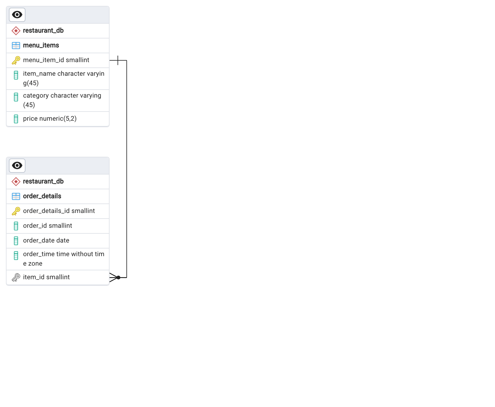

# Introduction

📊 Restaurant Order Analysis.

This analysis aims to uncover patterns in customer behavior through examining order data.

🔍 For access to SQL queries, kindly refer to the following location: [project_sql folder](/project_sql/)

# Background

This data comes from [Maven Analytics](https://app.mavenanalytics.io/guided-projects/d7167b45-6317-49c9-b2bb-42e2a9e9c0bc).


_ER Diagram_

```sql
ALTER TABLE restaurant_db.order_details
ADD FOREIGN KEY (item_id) REFERENCES restaurant_db.menu_items(menu_item_id);
```

### The questions I wanted to answer through my SQL queries were:

1. What were the least and most ordered items? What categories were they in?
2. What were the top 5 orders that spent the most money?
3. View the details of the highest spend order. Which specific items were purchased?
4. How do sales vary by month?
5. What times of day have the highest sales?
6. What is the average value of an order over a specific month?
7. How often do customers place orders in a month?
8. Which menu items generate the most revenue?
9. What are the top 10 best-selling menu items?

# Tools I Used

- **SQL:** The foundation of my analysis, empowering me to query the database and uncover invaluable insights.
- **PostgreSQL:** The chosen database management system.
- **Visual Studio Code:** My go-to for database management and executing SQL queries.
- **Git & GitHub:** Essential for version control and sharing my SQL scripts and analysis, ensuring collaboration and project tracking.

# The Analysis

### 1. What were the least and most ordered items? What categories were they in?

```sql
SELECT item_name, category, COUNT(order_details_id) AS number_purchases
FROM restaurant_db.order_details
INNER JOIN restaurant_db.menu_items
ON restaurant_db.order_details.item_id = restaurant_db.menu_items.menu_item_id
GROUP BY item_name, category
ORDER BY number_purchases ASC
LIMIT 1;
```

```sql
SELECT item_name, category, COUNT(order_details_id) AS number_purchases
FROM restaurant_db.order_details
INNER JOIN restaurant_db.menu_items
ON restaurant_db.order_details.item_id = restaurant_db.menu_items.menu_item_id
GROUP BY item_name, category
ORDER BY number_purchases DESC
LIMIT 1;
```

To identify the least and most ordered items, we use the GROUP BY statement on item_name and category, and count the frequency of each order using the count function on order_details_id.

From the results, we see that Chicken Tacos (Mexican category) is the least ordered item with 123 orders in the past three months. Conversely, Hamburgers (American category) are the most ordered item with 622 orders.

| item_name     | category | number_purchases |
| ------------- | -------- | ---------------- |
| Chicken Tacos | Mexican  | 123              |

_Table of least ordered items_

| item_name  | category | number_purchases |
| ---------- | -------- | ---------------- |
| Hamburgers | American | 622              |

_Table of most ordered items_

### 2. What were the top 5 orders that spent the most money?

```sql
SELECT order_id, SUM(price) AS total_spend
FROM restaurant_db.order_details
INNER JOIN restaurant_db.menu_items
ON restaurant_db.order_details.item_id = restaurant_db.menu_items.menu_item_id
GROUP BY order_id
ORDER BY sum(price) DESC
LIMIT 5;
```

To identify the top 5 highest spending orders, we use the GROUP BY statement on order_id and apply the SUM function on the price to calculate the total amount spent for each order.

From the results, we find that orders 440, 2075, 1957, 330, and 2675 are the highest paying orders.

| order_id | total_spend |
| -------- | ----------- |
| 440      | 192.15      |
| 2075     | 191.05      |
| 1957     | 190.10      |
| 330      | 189.70      |
| 2675     | 185.10      |

_Table of top 5 highest spending orders_

### 3. View the details of the highest spend order. Which specific items were purchased?

```sql
SELECT category, COUNT(item_id) AS num_items
FROM restaurant_db.order_details
INNER JOIN restaurant_db.menu_items
ON restaurant_db.order_details.item_id = restaurant_db.menu_items.menu_item_id
WHERE order_id = 440
GROUP BY category;
```

From the previous analysis, we identified the top 5 highest spending orders, with order 440 at the top. To examine the details of order 440, we use it as a filter. We then apply the GROUP BY statement on order_id and use the COUNT function on item_id to determine the specific items purchased.

The results show that order 440 included 8 Italian items, and 2 items each from the American, Asian, and Mexican categories.

| category | num_items |
| -------- | --------- |
| American | 2         |
| Asian    | 2         |
| Italian  | 8         |
| Mexican  | 2         |

_Table of specific items were purchased_

### How do sales vary by month?

```sql
SELECT EXTRACT(MONTH FROM order_date) AS month, SUM(price) AS total_sales
FROM restaurant_db.order_details
INNER JOIN restaurant_db.menu_items
ON restaurant_db.order_details.item_id = restaurant_db.menu_items.menu_item_id
GROUP BY month
ORDER BY total_sales DESC;
```

| month | total_sales |
| ----- | ----------- |
| 3     | 54610.60    |
| 1     | 53816.95    |
| 2     | 50790.35    |
